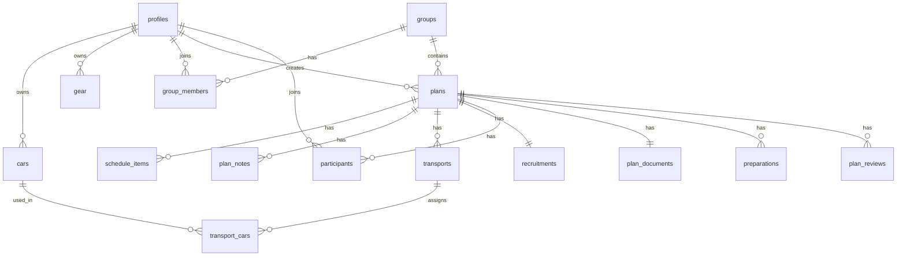

# アウトドアサークル運営アプリ 設計書（Claude Code 用）

> このドキュメントは Claude Code に渡すための設計書兼リファレンスです。
> プロジェクト直下に `docs/DESIGN.md` または `CLAUDE.md` として置き、各フェーズの実装プロンプトと一緒に参照させてください。

---

## 0. プロジェクト概要

アウトドアサークルの運営（計画立案・参加募集・学校提出用計画書作成・記録）を一元化する Web アプリ。
**複数のサークルが利用できる**マルチグループ構成とし、ユーザーはグループ（＝サークル）に参加または新規作成する。グループの中に複数の「計画（キャンプ・合宿・日帰り）」がぶら下がる。

### 技術スタック
- フレームワーク: **Next.js (App Router) + TypeScript**
- DB / 認証 / ストレージ: **Supabase**（Postgres + Supabase Auth + Storage）
- デプロイ: **Vercel**
- スタイリング: Tailwind CSS（推奨）
- フォーム: react-hook-form + zod（推奨）

### 重要な前提・方針
- 認証は **Supabase Auth のメール＋パスワード**。メールアドレスは任意だが、UI 上は学校用メールの入力を促す。
- Google Maps は **API キー不要のリンク方式**。`https://www.google.com/maps/search/?api=1&query={検索文字列}` を生成し、URL は画面に出さず場所名のボタンとして表示、タップで地図を開く。
- 病院情報は **起案者が手入力**（自動検索はしない）。
- 画像（プロフィール / 道具写真 / グループ画像）はすべて **Supabase Storage** に保存。
- 計画書(D)は **PDF 出力**。フォーマットは添付の様式に準拠しつつ整える（後述）。

---

## 1. ロールと権限

ロールは「計画ごと」に決まる相対的なもの。

| ロール | 定義 |
|---|---|
| **ALL（全員）** | そのグループのメンバー全員 |
| **参加者** | ある計画に参加確定したメンバー |
| **起案者** | その計画を作成したメンバー（作成時点で自動的に参加確定） |

グループ内の固定的な肩書き（部長 / 副部長 / 部員）は別概念で、`group_members.position` に持つ（計画書の名簿「役職」に使う）。

### 計画の状態（status）
- `draft`（下書き）: 一時保存可能。**起案者のみ閲覧可**。グループには未公開。
- `recruiting`（募集）: グループに公開。参加募集中。
- `past`（過去）: 終了済み。アーカイブ対象。

状態遷移: `draft → recruiting → past`（戻す操作は基本想定しないが、draft↔recruiting の往復は許可してよい）。

---

## 2. データモデル

### ER 図



### テーブル定義（Phase 0 で一括 migration）

```sql
-- A. プロフィール（auth.users を拡張）
create table profiles (
  id uuid references auth.users on delete cascade primary key,
  name text not null,
  grade int,                        -- 学年
  department text,                  -- 学科・コース
  student_id text,                  -- 学籍番号
  school_email text,                -- 学校用メール
  phone text,                       -- TEL（計画書用）
  academic_advisor text,            -- 指導教員氏名（名簿用、個人ごと）
  avatar_url text,                  -- Supabase Storage
  created_at timestamptz default now(),
  updated_at timestamptz default now()
);

-- A. 車の登録
create table cars (
  id uuid primary key default gen_random_uuid(),
  owner_id uuid references profiles(id) on delete cascade,
  name text,                        -- 車種・呼び名（任意）
  capacity int,                     -- 乗車人数
  luggage_capacity text,            -- 積載量（自由記述: 例「トランク中サイズ2個」）
  created_at timestamptz default now()
);

-- A. キャンプ道具の登録
create table gear (
  id uuid primary key default gen_random_uuid(),
  owner_id uuid references profiles(id) on delete cascade,
  name text not null,
  price int,                        -- 金額
  category text,                    -- カテゴリー（テント/寝袋/調理 等）
  quantity int,                     -- 個数
  capacity int,                     -- 対応人数
  photo_url text,                   -- Supabase Storage
  created_at timestamptz default now()
);

-- グループ（＝サークル）
create table groups (
  id uuid primary key default gen_random_uuid(),
  name text not null,
  image_url text,
  created_by uuid references profiles(id),
  created_at timestamptz default now()
);

-- グループのパスワード（参加用）。ハッシュをクライアントから読めないよう分離。
-- pgcrypto の crypt() でハッシュ化。RLS で全クライアントの直接アクセスを拒否し、
-- 参加/作成は SECURITY DEFINER の RPC からのみ操作する。
create table group_secrets (
  group_id uuid primary key references groups(id) on delete cascade,
  password_hash text not null
);

-- グループメンバー
create table group_members (
  id uuid primary key default gen_random_uuid(),
  group_id uuid references groups(id) on delete cascade,
  user_id uuid references profiles(id) on delete cascade,
  position text default '部員',      -- 役職（部長/副部長/部員）
  joined_at timestamptz default now(),
  unique (group_id, user_id)
);

-- 計画
create table plans (
  id uuid primary key default gen_random_uuid(),
  group_id uuid references groups(id) on delete cascade,
  creator_id uuid references profiles(id),     -- 起案者
  title text not null,                         -- 行事名
  category text,                               -- 合宿/キャンプ/日帰り
  status text default 'draft',                 -- draft/recruiting/past
  start_date date,
  end_date date,
  area text,                                   -- 大まかな場所
  description text,
  created_at timestamptz default now(),
  updated_at timestamptz default now()
);

-- B. 行程表の各行
create table schedule_items (
  id uuid primary key default gen_random_uuid(),
  plan_id uuid references plans(id) on delete cascade,
  day date,
  time time,
  sort_order int default 0,
  time_label text,                  -- 集合/出発/到着/解散
  location_name text,
  location_type text,               -- meeting(集合)/destination(目的地)/dissolution(解散)
  map_query text,                   -- google maps 検索用文字列（住所 or 施設名）
  created_at timestamptz default now()
);

-- B. 注釈
create table plan_notes (
  id uuid primary key default gen_random_uuid(),
  plan_id uuid references plans(id) on delete cascade,
  note_type text,                   -- general(起案者より)/route(経路)/place(場所)/items(持ち物)
  body text
);

-- B. 交通手段
create table transports (
  id uuid primary key default gen_random_uuid(),
  plan_id uuid references plans(id) on delete cascade,
  type text,                        -- airplane/car/train/other
  note text
);

-- B. 車の割り当て（type=car のとき）
create table transport_cars (
  id uuid primary key default gen_random_uuid(),
  transport_id uuid references transports(id) on delete cascade,
  car_id uuid references cars(id),  -- 所有者画像・乗車人数はこの参照から取得
  note text
);

-- C. 募集
create table recruitments (
  id uuid primary key default gen_random_uuid(),
  plan_id uuid references plans(id) on delete cascade unique,
  type text,                        -- first_come(先着順)/deadline(時間締切)
  capacity int,                     -- 定員（達したら締切）
  deadline timestamptz,             -- 時間締切の場合
  is_closed boolean default false
);

-- C. 参加者
create table participants (
  id uuid primary key default gen_random_uuid(),
  plan_id uuid references plans(id) on delete cascade,
  user_id uuid references profiles(id) on delete cascade,
  joined_at timestamptz default now(),    -- 先着順の並びに使う
  unique (plan_id, user_id)
);

-- D. 計画書（起案者情報・参加者名簿は profiles/participants から生成）
create table plan_documents (
  id uuid primary key default gen_random_uuid(),
  plan_id uuid references plans(id) on delete cascade unique,
  created_date date,                -- 計画書作成日
  advisor_name text,                -- 顧問教員氏名
  advisor_affiliation text,         -- 顧問教員の所属
  advisor_phone text,               -- 顧問教員 TEL
  lodging_name text,                -- 宿泊場所の名称
  lodging_address text,
  lodging_phone text,
  hospital_name text,               -- 周辺の総合病院
  hospital_address text,
  hospital_phone text,
  hospital_distance text,           -- 宿泊所からの距離（手入力）
  notes text,                       -- 備考
  created_at timestamptz default now()
);

-- E. 準備
create table preparations (
  id uuid primary key default gen_random_uuid(),
  plan_id uuid references plans(id) on delete cascade,
  user_id uuid references profiles(id),
  type text,                        -- gear(道具を持っていくか)/place(追加で行きたい場所)
  body text,
  created_at timestamptz default now()
);

-- F. アーカイブのコメント
create table plan_reviews (
  id uuid primary key default gen_random_uuid(),
  plan_id uuid references plans(id) on delete cascade,
  user_id uuid references profiles(id),
  body text,                        -- 活動を終えて（感想・事故など）
  cost_per_person int,              -- 一人あたりの費用
  created_at timestamptz default now()
);
```

### RLS（Row Level Security）方針
全テーブルで RLS を有効化し、おおむね以下のポリシーを置く（Phase 0 で雛形を作り、各フェーズで調整）:

- `profiles`: 本人は全操作可。同じグループのメンバーは閲覧可（名簿表示・所有者表示のため）。
- `cars` / `gear`: 所有者本人が全操作可。同じグループのメンバーは閲覧可（交通手段の割り当て表示のため）。
- `groups`: **認証ユーザーは全グループの id/name/image を閲覧可**（参加前に一覧から選ぶため）。作成・更新は RPC 経由。
- `group_secrets`: **全クライアントの select/insert/update/delete を拒否**。`create_group` / `join_group` の SECURITY DEFINER RPC からのみ操作。
- `group_members`: メンバーは同グループの行を閲覧可。参加（insert）は `join_group` RPC 経由のみ。
- `plans`: `status='draft'` は起案者のみ閲覧可。それ以外はグループメンバーが閲覧可。作成・更新・削除は起案者のみ。
- `schedule_items` / `plan_notes` / `transports` / `transport_cars` / `recruitments` / `plan_documents`: 親 plan の起案者のみ書き込み可、グループメンバーは閲覧可（draft を除く）。
- `participants`: 本人が自分の参加行を insert/delete 可。グループメンバーは閲覧可。
- `preparations` / `plan_reviews`: 書き込みは本人、閲覧はグループメンバー。

> Claude Code への注意: RLS は「ヘルパー関数 `is_group_member(group_id)` を作り、各ポリシーから呼ぶ」形にすると重複が減る。

---

## 3. ルーティング構成（App Router）

```
app/
  (auth)/
    login/page.tsx
    signup/page.tsx
  (app)/
    layout.tsx                      // 認証ガード + ナビ
    profile/page.tsx                // プロフィール編集（A）
    profile/cars/page.tsx           // 車の登録（A）
    profile/gear/page.tsx           // 道具の登録（A）
    groups/page.tsx                 // グループ一覧 / 参加 / 作成
    groups/new/page.tsx             // グループ作成
    groups/[groupId]/page.tsx       // グループのダッシュボード（計画一覧: 募集/過去）
    groups/[groupId]/plans/new/page.tsx
    groups/[groupId]/plans/[planId]/page.tsx          // 計画詳細（行程・募集・準備）
    groups/[groupId]/plans/[planId]/edit/page.tsx     // 起案者の編集
    groups/[groupId]/plans/[planId]/document/page.tsx // 計画書(D)
lib/
  supabase/                         // client / server クライアント
  maps.ts                           // map_query から Maps URL を生成
```

---

## 4. フェーズ計画

**重要: 1フェーズ＝1プロンプトで段階的に依頼すること。** 一度に全部を作らせないこと。
各フェーズ完了後に `npm run build` が通り、手動で動作確認できる状態をゴールにする。

| フェーズ | 内容 | 主なテーブル |
|---|---|---|
| **Phase 0** | プロジェクト初期化・Supabase 接続・**全スキーマ migration**・認証基盤・RLS 雛形 | 全テーブル |
| **Phase 1** | アカウントモジュール A（プロフィール / 車 / 道具） | profiles, cars, gear |
| **Phase 2** | グループ（作成 / 参加 / 一覧 / ダッシュボード） | groups, group_members |
| **Phase 3** | 計画 + 行程表 B（下書き保存・状態管理・Maps リンク・交通手段） | plans, schedule_items, plan_notes, transports, transport_cars |
| **Phase 4** | 募集 C（先着順 / 時間締切・参加可否・参加者一覧） | recruitments, participants |
| **Phase 5** | 計画書 D（フォーム入力 + PDF 出力） | plan_documents |
| **Phase 6** | 準備 E + アーカイブ F | preparations, plan_reviews |

---

## 5. そのまま Claude Code に貼るプロンプト（Phase 0 + Phase 1）

> 下の囲みをコピーして Claude Code に渡してください。Phase 2 以降は同じ要領で「Phase N の内容」を指定すれば進められます。

````
あなたは熟練の Next.js + Supabase エンジニアです。アウトドアサークル運営アプリを段階的に作ります。
プロジェクトのルートに置いた docs/DESIGN.md（このリポジトリにある設計書）を必ず読み、データモデル・ロール・命名規則に従ってください。今回は Phase 0 と Phase 1 のみ実装します。Phase 2 以降には手を出さないでください。

【技術スタック】
- Next.js (App Router) + TypeScript
- Supabase（Postgres + Auth + Storage）
- Tailwind CSS / react-hook-form + zod

【Phase 0: 基盤構築】
1. Next.js プロジェクトを TypeScript + Tailwind + App Router で初期化（既存なら確認のみ）。
2. @supabase/supabase-js と @supabase/ssr を導入し、lib/supabase/client.ts（ブラウザ用）と lib/supabase/server.ts（サーバー用）を作成。環境変数は NEXT_PUBLIC_SUPABASE_URL / NEXT_PUBLIC_SUPABASE_ANON_KEY を使い、.env.local.example を用意。
3. supabase/migrations/ に「DESIGN.md のテーブル定義（profiles, cars, gear, groups, group_members, plans, schedule_items, plan_notes, transports, transport_cars, recruitments, participants, plan_documents, preparations, plan_reviews）」を全て含む SQL migration を1ファイルで作成。
4. 全テーブルで RLS を有効化し、DESIGN.md の「RLS 方針」に沿ったポリシーを作成。重複を避けるため is_group_member(gid uuid) のような SECURITY DEFINER ヘルパー関数を用意し、各ポリシーから利用すること。
5. 新規ユーザー登録時に profiles 行を自動作成する trigger（auth.users への insert をフック）を作成。
6. メール＋パスワードの認証フロー（/login, /signup, ログアウト）と、(app) セグメントの認証ガード layout を実装。サインアップ画面では「学校用メールアドレスの入力を推奨」する注釈を表示するが、メールの種類は制限しない。

【Phase 1: アカウントモジュール A】
対象テーブル: profiles, cars, gear のみ。
1. /profile: プロフィール編集（name, grade(学年), department(学科・コース), student_id(学籍番号), school_email, phone(TEL), academic_advisor(指導教員氏名), avatar_url）。
   - avatar は Supabase Storage の "avatars" バケットにアップロードし、表示・差し替え可能に。
2. /profile/cars: 車の登録・編集・削除（name, capacity(乗車人数), luggage_capacity(積載量・自由記述)）。一覧表示も。
3. /profile/gear: 道具の登録・編集・削除（name, price(金額), category(カテゴリー), quantity(個数), capacity(対応人数), photo_url）。
   - 写真は Storage の "gear" バケットにアップロードし、一覧でサムネイル表示。
4. Storage バケット（avatars, gear）の作成手順とポリシー（本人のみ書き込み・閲覧は認証ユーザー）を migration かセットアップ手順として残すこと。

【守ってほしいこと】
- DESIGN.md のカラム名・型に厳密に従う。勝手にスキーマを変えない。変更が必要と判断したら、まず提案して理由を説明し、承認を待つ。
- フォームは zod でバリデーション。サーバー側の更新は Server Actions を使ってよい。
- 各ステップ完了時に「何を作ったか」「次に私が手動で確認すべきこと（Supabase 側の設定含む）」を箇条書きで報告する。
- Phase 1 完了時点で npm run build が通り、ログイン→プロフィール編集→車・道具登録まで一通り動く状態をゴールとする。
- Phase 2 以降の機能（グループ・計画・募集など）は実装しない。
````

---

## 5.5 そのまま Claude Code に貼るプロンプト（Phase 2: グループ）

> Phase 0+1 が完了し動作確認できた後に渡してください。

````
あなたは熟練の Next.js + Supabase エンジニアです。アウトドアサークル運営アプリの続きを実装します。
docs/DESIGN.md を必ず読み、データモデル・ロール・命名規則・RLS 方針に従ってください。
Phase 0・Phase 1 は完了済みです。今回は Phase 2（グループ）のみを実装し、Phase 3 以降には手を出さないでください。

【Phase 2: グループモジュール】
対象テーブル: groups, group_secrets, group_members。
参加方式は「パスワード制」です。

1. DB / RPC（supabase/migrations に追加）
   - pgcrypto 拡張を有効化する。
   - group_secrets テーブルがまだなければ DESIGN.md の定義どおり作成し、RLS で全クライアントの直接アクセスを拒否する。
   - groups の RLS を更新し、認証ユーザーは全グループの行（id/name/image）を select できるようにする。
   - SECURITY DEFINER 関数 create_group(p_name text, p_image_url text, p_password text) を作成:
     ・groups に1行 insert（created_by = auth.uid()）
     ・group_secrets に crypt(p_password, gen_salt('bf')) のハッシュを insert
     ・group_members に作成者を position='部長' で insert
     ・作成した group_id を返す
   - SECURITY DEFINER 関数 join_group(p_group_id uuid, p_password text) を作成:
     ・group_secrets の password_hash と crypt(p_password, password_hash) を比較して検証
     ・一致したら group_members に auth.uid() を position='部員' で insert（既に参加済みなら何もしない）
     ・パスワード不一致時はエラー（例外）を返す
   - SECURITY DEFINER 関数 leave_group(p_group_id uuid) を作成:
     ・auth.uid() の group_members 行を削除（最後の1人＝作成者の扱いは「削除可。ただしグループ自体は残す」で良い。複雑にしない）

2. 画面（app/(app)/groups/）
   - groups/page.tsx: 「自分が参加しているグループ一覧」と「参加していないグループ一覧（参加ボタン付き）」を表示。各グループは画像＋名前のカードで表示。自分のグループのカードはダッシュボードへ遷移。
   - 参加フロー: 未参加グループの「参加」ボタンを押すとパスワード入力モーダル/フォームを表示し、join_group RPC を呼ぶ。成功したら一覧を更新、失敗したらエラー表示。
   - groups/new/page.tsx: グループ作成フォーム（name 必須、image アップロード任意、参加用パスワード必須）。画像は Storage の "group-images" バケットにアップロード。送信時に create_group RPC を呼び、成功したら作成したグループのダッシュボードへ遷移。
   - groups/[groupId]/page.tsx: グループのダッシュボード。
     ・グループ名・画像を表示。
     ・メンバー一覧（avatar・氏名・役職・学年）を表示。
     ・「このグループの計画一覧」のプレースホルダ領域を用意（タブで「募集中」「過去」を切り替えられる枠だけ作る。中身＝plans の取得は Phase 3 で実装するので、ここでは "Phase 3 で実装" の空状態でよい）。
     ・「脱退」ボタン（leave_group RPC）。
   - グループのダッシュボードや詳細は、そのグループのメンバーでないとアクセスできないようガードする（メンバーでなければ groups 一覧へリダイレクト）。

3. Storage
   - "group-images" バケットを作成し、書き込みは認証ユーザー、閲覧は認証ユーザー、というポリシーを設定。手順を migration かセットアップ手順として残す。

【守ってほしいこと】
- DESIGN.md のカラム名・型・RPC 仕様に厳密に従う。スキーマ変更が必要と判断したら、まず提案して理由を説明し承認を待つ。
- パスワードは平文で保存・ログ出力しない。検証は必ず DB 側の crypt() で行い、ハッシュをクライアントに返さない。
- フォームは zod でバリデーション、更新系は Server Actions または RPC 呼び出しで実装。
- 各ステップ完了時に「何を作ったか」「私が手動で確認すべきこと（Supabase の設定含む）」を箇条書きで報告する。
- Phase 2 完了時点で npm run build が通り、グループ作成→別アカウントでパスワード参加→ダッシュボード表示→脱退、まで一通り動く状態をゴールとする。
- Phase 3 以降の機能（計画・行程表・募集など）は実装しない。計画一覧は空状態のプレースホルダで止める。
````


添付様式に準拠する。固定値・自動取得・手入力の切り分けは以下:

- **団体名**: グループ名（`groups.name`）から取得。
- **宛先・所属等**: 「九州工業大学情報工学研究院長 殿」「情報工学研究院 知能情報工学研究系」等は様式の固定文言としてテンプレートに持つ（必要なら設定で変更可能に）。
- **起案者代表 / 代表者氏名・学籍番号・所属・TEL・E-mail**: 起案者の `profiles` から自動取得。
- **顧問教員氏名・所属・TEL**: `plan_documents` に手入力。
- **行事名 / 日時 / 場所 / 日程 / 移動手段 / 参加人数**: `plans`・`schedule_items`・`transports`・`participants` から生成。
  - 日程は schedule_items を日付・時刻順に整形（例「10:00 大学集合 / 13:00 キャンプ場到着」）。
  - 移動手段は車の台数も含めて表記。
- **宿泊所 / 周辺の病院等 / 距離 / 備考**: `plan_documents` に手入力。
- **参加者名簿**: `participants` × `profiles`（参加者番号・学生番号・役職[group_members.position]・学年・氏名・TEL・指導教員氏名・所属・E-mail）。

PDF 生成は `@react-pdf/renderer` を推奨（日本語フォント埋め込みに注意。Noto Sans JP などを同梱）。

---

## 7. 今後の検討事項（必要になったら詰める）
- ~~グループへの参加方法~~ → **決定: パスワード制**（グループ作成時にパスワードを設定し、参加時にグループを選んでパスワードを入力）。Phase 2 で実装。
- 募集の同時参加による定員超過の競合制御（先着順を厳密にするなら participants 挿入時にトランザクション or DB 制約で枠を担保）。Phase 4 で要検討。
- 計画書の様式が学科・行事種別で変わる場合のテンプレート切り替え。
- グループからの脱退・メンバー削除・役職変更（部長による管理）の運用。Phase 2 では最低限「脱退」のみ実装し、管理機能は後回しでよい。